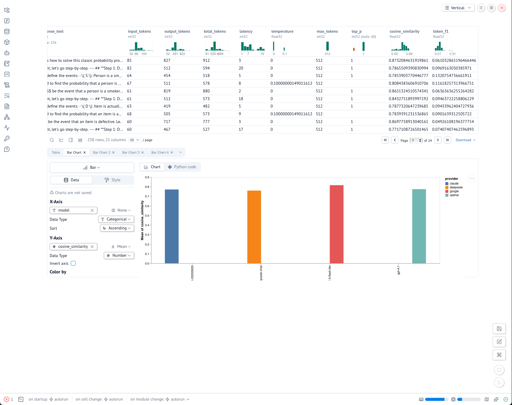

### LLM Evals Lab



A small, realistic LLM evaluation lab you can clone and run locally.

This repo simulates the kind of internal eval pipeline a team would use to answer:

“Which model should we use for this task, and how is it changing over time?”

It focuses on reasoning-style questions (e.g. basic statistics / numeracy), and compares multiple providers (OpenAI, Anthropic, Google) end-to-end:
	1.	Synthesize a dataset of questions using an LLM.
	2.	Run multiple models on that dataset.
	3.	Store everything in DuckDB in a raw schema.
	4.	Transform with dbt into an analytics schema.
	5.	Compute metrics (F1, cosine similarity, token usage, latency).
	6.	Explore results with SQL + charts.


### High-level architecture

```mermaid
flowchart LR
    A[Prompt\n(task spec)] --> B[SynthesizerModel\n(ChatGPT, structured output)]
    B -->|JSONL dataset| C[data/raw/*.jsonl]

    C --> D[Ingest pipeline\n(ingest_jsonl_to_raw)]
    D -->|INSERT| E[(DuckDB\nschema: raw)]

    E --> F[dbt models\nstaging + mart]
    F -->|CREATE VIEW/TABLES| G[(DuckDB\nschema: analytics)]

    G --> H[Analysis\nSQL / notebook / charts]
    G --> I[Model comparison\nmetrics tables]
```

### Features
	+	Provider-agnostic runners
	+	OpenAIRunner, ClaudeRunner, GeminiRunner with a common ModelRunner protocol.
	+	LLM-generated evaluation datasets
	+	SynthesizerModel uses structured output (Pydantic) to generate JSONL datasets with metadata.
	+	Warehouse-style storage
	+	DuckDB database with raw and analytics schemas.
	+	dbt-duckdb for transforms, joins, and metrics.
	+	Task + metrics for reasoning
	+	Reasoning/statistics Q&A task.
	+	Token-level F1, cosine similarity, token usage, latency.
	+	Incremental analytics
	+	dbt models materialized incrementally, so new runs append cleanly.
